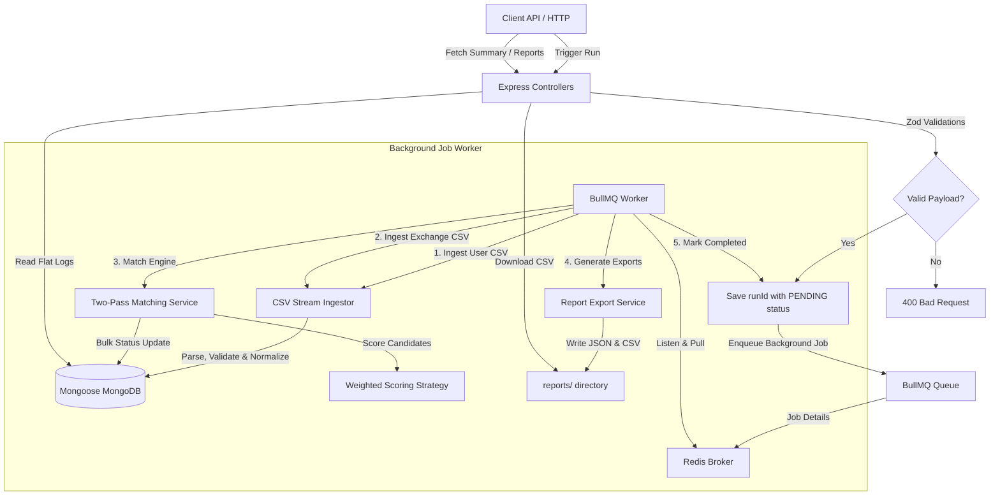
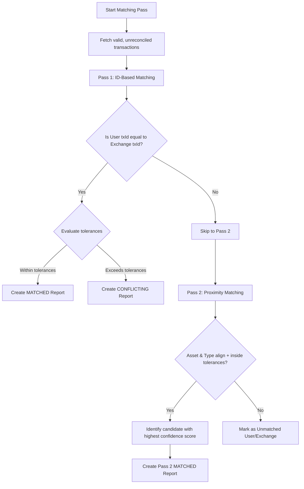

# 📊 Cryptographic Transaction Reconciliation Engine

A high-performance, production-grade, modular Node.js backend application designed to ingest, validate, normalize, and reconcile transaction data (specifically targeting crypto user ledger balances vs. exchange data streams).

---

## 📖 Project Overview

Financial institutions and crypto funds handle millions of trades daily across multiple exchanges, custody providers, and hardware wallets. Ensuring the accuracy of local ledgers against external statements is a critical requirement for tax, compliance, and auditing.

This **Transaction Reconciliation Engine** solves this problem by providing a highly scalable backend service that:
1. **Ingests** large CSV datasets representing User ledgers and Exchange transaction histories via high-efficiency stream parsers.
2. **Validates & Normalizes** data to handle malformed timestamps, capitalization differences, asset aliases (e.g., `bitcoin` ➔ `BTC`), and duplicate records, without discarding data.
3. **Reconciles** records using a **two-pass scoring algorithm** that pairs identical IDs first, followed by proximity-based matching on unresolved records.
4. **Generates Reports & Exports** detailing matches, conflicts (discrepancies in quantities or types), and unmatched transactions to both JSON and CSV files.

---

## 🏗️ Architecture

The engine is built on **decoupled service boundaries**, separating HTTP routing, controller payload handling, database queries (Repository Pattern), and background queues.

### System Workflow


### Module Breakdown

* **`src/config/`**: Centralizes database, Redis, and global tolerance default configuration.
* **`src/ingestion/`**: Stream parser that processes CSV records line-by-line (`O(1)` memory), validating fields and normalizing strings.
* **`src/matching/`**: Core matching rules and orchestration service conducting two passes (ID-based, then proximity-based).
* **`src/reporting/`**: Report service converting matching outcomes into flat JSON arrays and compliant CSV sheets.
* **`src/repositories/`**: Database abstraction layer implementing the Repository pattern over Mongoose models.
* **`src/models/`**: MongoDB Mongoose schemas for transactions, runs, and reports.
* **`src/jobs/`**: BullMQ async Queue and Worker handlers processing CPU-bound calculations in the background.

---

## 🚀 Setup & Installation

### Prerequisites
* **Node.js** (v18 or higher recommended)
* **MongoDB** (Local instance or Mongo Atlas URL)
* **Redis** (Local instance or hosted URL for BullMQ)

### Installation
1. Clone the repository and navigate to the project directory:
   ```bash
   cd KoinX
   ```
2. Install the production and development dependencies:
   ```bash
   npm install
   ```

---

## ⚙️ Environment Variables

Configure environment variables by copying `.env.example` to a new file named `.env`:
```bash
cp .env.example .env
```

Define the following environment variables:
```env
PORT=3000
MONGODB_URI=mongodb://127.0.0.1:27017/reconciliation
REDIS_URL=redis://127.0.0.1:6379

# Fallback global matching tolerances (used if not passed in API trigger payload)
TIMESTAMP_TOLERANCE_SECONDS=60
QUANTITY_TOLERANCE_PCT=0.02
```

---

## 💻 Running Locally

### 1. Running the Test Suite (Jest)
Run unit and integration test suites utilizing a standalone, sandboxed, in-memory MongoDB server:
```bash
npm test
```

### 2. Standalone Verification Suites
To test components individually against sandbox in-memory servers:
```bash
# Verify schemas, models, and indexing
npm run verify

# Verify ingestion parser & validation logs
node src/verify-ingestion.js

# Verify two-pass matching engine & conflict logs
node src/verify-reconciliation.js

# Verify JSON & CSV exporters
node src/verify-reporting.js

# Verify async workers & BullMQ integration
node src/verify-queue.js
```

### 3. Run Development Server
Launches the Express listener and BullMQ background worker in watch mode:
```bash
npm run dev
```

### 4. Run Production Server
```bash
npm run start
```

---

## 📄 Sample CSV Usage

The parser expects CSV files representing user ledgers and exchange statements under the following layouts:

### User Transactions (`samples/user_transactions.csv`)
| Column | Type | Required | Description / Example |
| :--- | :--- | :--- | :--- |
| `transaction_id` | String | Yes | Local user ledger transaction ID (e.g., `USR-001`) |
| `timestamp` | ISO String | Yes | Time transaction occurred (e.g., `2024-03-01T09:00:00Z`) |
| `type` | String | Yes | `BUY`, `SELL`, `TRANSFER_OUT` |
| `asset` | String | Yes | Asset identifier, alias supported (e.g., `bitcoin` ➔ `BTC`) |
| `quantity` | Number | Yes | Positive amount (e.g., `0.5`) |
| `price_usd` | Number | No | Price in USD (e.g., `62000.00`) |
| `fee` | Number | No | Optional fee (e.g., `0.0005`) |

### Exchange Transactions (`samples/exchange_transactions.csv`)
| Column | Type | Required | Description / Example |
| :--- | :--- | :--- | :--- |
| `transaction_id` | String | Yes | Exchange statement unique identifier (e.g., `EXC-1001`) |
| `timestamp` | ISO String | Yes | Time transaction occurred (e.g., `2024-03-01T09:00:32Z`) |
| `type` | String | Yes | `BUY`, `SELL`, `TRANSFER_IN` |
| `asset` | String | Yes | Standard code (e.g., `BTC`) |
| `quantity` | Number | Yes | Positive amount (e.g., `0.5`) |
| `price_usd` | Number | No | Price in USD (e.g., `62000.00`) |
| `fee` | Number | No | Optional fee (e.g., `0.0005`) |

### How Validation Errors Are Handled
In compliance with regulatory requirements, **no row is ever dropped during parsing**. If a row is invalid:
1. It is stored in the database with `ingestionStatus.valid = false`.
2. An array of descriptive issues is added to the record (e.g., `["Missing required field: timestamp"]` or `["Quantity must be positive: -1.5"]`).
3. The invalid transaction is excluded from matching passes but kept in database logs for auditable reviews.

---

## 📡 API Documentation & Examples

All API requests are prefixed with `/api/reconciliation`.

### 1. Trigger Async Reconciliation
Validates paths, instantiates a run tracker, and enqueues a background job.

* **URL**: `POST /api/reconciliation/reconcile`
* **Content-Type**: `application/json`
* **Request Body**:
```json
{
  "userFile": "samples/user_transactions.csv",
  "exchangeFile": "samples/exchange_transactions.csv",
  "config": {
    "timestampTolerance": 60,
    "quantityTolerance": 0.02
  }
}
```
* **cURL Command**:
```bash
curl -X POST http://localhost:3000/api/reconciliation/reconcile \
  -H "Content-Type: application/json" \
  -d '{"userFile":"samples/user_transactions.csv","exchangeFile":"samples/exchange_transactions.csv","config":{"timestampTolerance":60,"quantityTolerance":0.02}}'
```
* **Response (`202 Accepted`)**:
```json
{
  "runId": "47a3e7de-cae9-4e89-9a2c-f601de9d2824",
  "status": "queued"
}
```

---

### 2. Fetch Run Summary Metrics
Retrieves current processing state and reconciliation statistics counters.

* **URL**: `GET /api/reconciliation/report/:runId/summary`
* **cURL Command**:
```bash
curl -X GET http://localhost:3000/api/reconciliation/report/47a3e7de-cae9-4e89-9a2c-f601de9d2824/summary
```
* **Response (`200 OK`)**:
```json
{
  "success": true,
  "status": "COMPLETED",
  "summary": {
    "totalTransactions": 51,
    "matchedCount": 44,
    "conflictingCount": 2,
    "unmatchedUserCount": 1,
    "unmatchedExchangeCount": 4
  }
}
```

---

### 3. Fetch Full Flat Report
Fetches the reconciled ledger entries (populated with transaction details) mapped to the specified flat layout.

* **URL**: `GET /api/reconciliation/report/:runId`
* **cURL Command**:
```bash
curl -X GET http://localhost:3000/api/reconciliation/report/47a3e7de-cae9-4e89-9a2c-f601de9d2824
```
* **Response (`200 OK`)**:
```json
{
  "success": true,
  "reports": [
    {
      "category": "matched",
      "confidence": 0.9733,
      "reason": "Pass 2 Proximity Match: Confirmed match: type aligns, time difference 32.0s, quantity variance 0.000%",
      "user_txId": "USR-001",
      "user_timestamp": "2024-03-01T09:00:00.000Z",
      "user_asset": "BTC",
      "user_quantity": 0.5,
      "exchange_txId": "EXC-1001",
      "exchange_timestamp": "2024-03-01T09:00:32.000Z",
      "exchange_asset": "BTC",
      "exchange_quantity": 0.5
    }
  ]
}
```

---

### 4. Fetch Unmatched Records
Returns records belonging strictly to unmatched user or exchange categories for audit review.

* **URL**: `GET /api/reconciliation/report/:runId/unmatched`
* **cURL Command**:
```bash
curl -X GET http://localhost:3000/api/reconciliation/report/47a3e7de-cae9-4e89-9a2c-f601de9d2824/unmatched
```
* **Response (`200 OK`)**:
```json
{
  "success": true,
  "unmatched": [
    {
      "category": "unmatched_exchange",
      "confidence": 1,
      "reason": "No matching user transaction found by ID or proximity window.",
      "user_txId": "",
      "user_timestamp": "",
      "user_asset": "",
      "user_quantity": "",
      "exchange_txId": "EXC-1024",
      "exchange_timestamp": "2024-03-13T18:00:00.000Z",
      "exchange_asset": "ETH",
      "exchange_quantity": 0.6
    }
  ]
}
```

---

### 5. Export Report CSV
Initiates file download of the exported CSV sheet from the reports directory.

* **URL**: `GET /api/reconciliation/report/:runId/export`
* **cURL Command**:
```bash
curl -o report.csv http://localhost:3000/api/reconciliation/report/47a3e7de-cae9-4e89-9a2c-f601de9d2824/export
```
* **Response (`200 OK`)**: File download attachment `reconciliation_report_${runId}.csv`.

---

## 🧠 Matching Logic

Reconciliation is executed in **two sequential passes**:



### 1. Pass 1: ID-Based Matching
Matches user ledger transactions to exchange transactions with identical transaction IDs (`txId`).
* **Match confirmed**: If type aligns, and differences in timestamps and quantities are within tolerance limits.
* **Conflict logged**: If transaction IDs are identical but quantities differ, transaction types mismatch, or timestamps exceed tolerances. This indicates data discrepancies (e.g., human ledger entry errors).

### 2. Pass 2: Proximity Matching (Fuzzy Search)
Applies to remaining unmatched records (e.g., User transactions recorded with a different local ID structure than the Exchange statement).
* Matches pairs based on asset, type, timestamp difference (must be within `timestampTolerance`), and quantity variance (must be within `quantityTolerance`).
* Resolves **TRANSFER_OUT** (User ledger sending out) ➔ **TRANSFER_IN** (Exchange ledger receiving in).
* Maps user record to the candidate exchange record yielding the **highest confidence score**.

---

## ⚡ Design Decisions & Algorithmic Tradeoffs

### 1. Why Greedy Choice instead of Maximum Bipartite Matching?
* **Problem**: In graph theory, matching nodes in a bipartite graph (User transactions mapped to Exchange transactions) is ideally solved using global optimizations such as the Hungarian Algorithm.
* **Tradeoff**: The Hungarian Algorithm runs in **`O(V³)`** time. If we reconcile $100,000$ transactions, it would require $10^{15}$ operations, which is computationally impossible for realtime or queue-based backend servers.
* **Solution**: The engine uses a localized **Greedy Proximity Choice** bounded by time windows. Transactions are partitioned by Asset and Type first. For a given transaction, we search only within the specific time tolerance window. This limits the search to a small subset, reducing complexity in practice close to **`O(N + M)`**.
* **Order Preservation**: Running Pass 1 first ensures that exact ID matches are locked in and removed from the candidate pool, preventing greedy matching in Pass 2 from falsely claiming them.

### 2. Weighted Confidence Scoring
Fuzzy matching requires mathematical evaluations. We score matching pairs on a $100$-point scale:
* **Type Alignment (Weight: 20)**: $20$ points are awarded if types align (identical or transfer mappings), otherwise $0$.
* **Timestamp Proximity (Weight: 50)**: Decays linearly as the difference approaches the tolerance window:
  $$\text{Score}_{\text{time}} = 50 \times \left(1 - \frac{\text{TimeDiffSeconds}}{\text{TimestampTolerance}}\right)$$
* **Quantity Proximity (Weight: 30)**: Decays linearly as difference approaches the quantity tolerance limit:
  $$\text{Score}_{\text{qty}} = 30 \times \left(1 - \frac{\text{QtyVariancePercentage}}{\text{QuantityTolerance}}\right)$$

* **Match Threshold**: A match is established only if the candidates are within tolerances for all criteria, giving operations teams clear audit trails for low-confidence matches.

---

## 🛡️ Edge Cases Handled

* **Duplicate Ingestion IDs**: If the same `txId` is found twice in a single CSV file, the database saves both to preserve complete audit history. The first transaction is saved as valid, and subsequent occurrences are saved as invalid (`ingestionStatus.valid = false`) with `Duplicate transaction ID within run` logged.
* **Missing IDs**: Transactions missing transaction IDs on user ledgers are successfully processed during Pass 2 using proximity search.
* **Timezone Mismatches**: Timestamp parses support arbitrary timezone string inputs. All date values are converted and saved in standard UTC.
* **Conditional Unique Indexes**: Compound unique constraints on `(runId, source, normalized.txId)` are partial, filtering on `{ "ingestionStatus.valid": true }` to allow saving duplicate malformed records.

---

## 📈 Future Enhancements

1. **Horizontal Worker Scaling**:
   - BullMQ decouples Express routing from task processing. Workers can run in separate processes or containers, scaling out to meet ingestion demands.
2. **Database Sharding**:
   - The database can be partitioned by sharding MongoDB on `runId`. Since matching calculations only process records with the same `runId`, queries never need cross-shard joins.
3. **Advanced Graph-Based Window Matching**:
   - Implementing dynamic-window maximum flow matching algorithms (e.g. Hopcroft-Karp over localized time-frames) to handle massive blocks of non-unique trades.

---

## 📤 Submission Instructions

1. **Environment Setup**: Ensure MongoDB and Redis are active.
2. **Launch Dev Stack**: Start dependencies and run `npm run dev`.
3. **Trigger Reconciliation**: Run the cURL trigger command using the sample files provided in `/samples`.
4. **Export CSV**: Run the export API call to download and inspect the generated reconciliation sheet.
