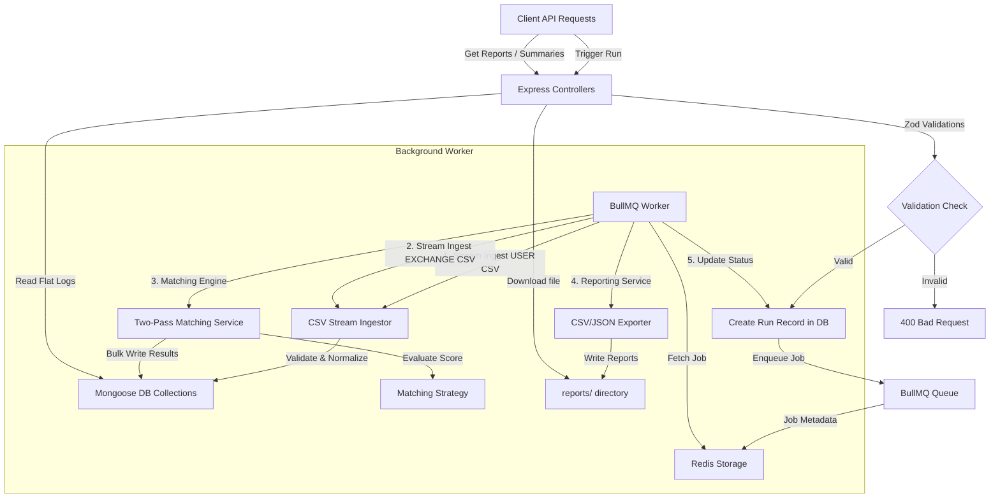

# 📊 Cryptographic Transaction Reconciliation Engine

A high-performance, production-grade, modular Node.js backend application designed to ingest, normalize, and reconcile transaction data (specifically targeting crypto user ledgers vs. exchange data streams).

---

## 🏗️ Architectural Overview

The engine is built with clean separation of concerns, adhering to the **Repository Pattern** and a decoupled **Service Layer** structure:



### Key Components

1. **Ingestion Module (`src/ingestion`)**:
   - **Stream Parser**: Reads multi-gigabyte CSV files using Node.js readable streams (`csv-parse`), maintaining a stable memory footprint (`O(1)` memory overhead).
   - **Validator**: Enforces structural validations (non-empty fields, positive numeric quantities, correct Date parsing) and logs anomalies **without dropping records** (ensures audit compliance).
   - **Normalizer**: Standardizes assets (`bitcoin` ➔ `BTC`, `solana` ➔ `SOL`), uppercase transaction types, and parses timestamps into ISO UTC dates.

2. **Matching Engine (`src/matching`)**:
   - **Pass 1 (ID-Based)**: Scans transaction sets for matching unique identifiers (`txId`). Confirms identical records or logs discrepancies (`conflicting`) if quantities, types, or dates do not match.
   - **Pass 2 (Proximity-Based)**: Conducts localized search matching on unresolved transactions based on type, asset, timestamp proximity, and quantity tolerance thresholds.

3. **Reporting Service (`src/reporting`)**:
   - Generates and saves flattened reconciliation logs as JSON and formatted CSV exports inside the `reports/` folder.

4. **REST APIs & Controllers (`src/routes`, `src/controllers`)**:
   - Centralizes routing tree for enqueuing jobs, inspecting execution status summaries, listing unmatched records, and downloading CSV reports.

5. **Asynchronous Jobs (`src/jobs`)**:
   - Orchestrated by **BullMQ** and **Redis** to ensure heavy computations do not block the HTTP event loop, providing horizontal scale-out capabilities.

---

## ⚡ Design Decisions & Algorithmic Tradeoffs

### Why Greedy Proximity Matching?
Reconciliation engines face massive volume spikes. The engine implements a local greedy search inside the proximity pass:
1. **Time Complexity**: Standard global optimization algorithms (e.g., the Hungarian Algorithm for Maximum Weight Bipartite Matching) run in **`O(V³)`** time, which is computationally prohibitive for financial transaction volumes (e.g., matching $100,000$ transactions would take $10^{15}$ operations).
2. **Greedy Proximity**: Partitioning search sets by **Asset** and **Type**, then evaluating localized matches reduces search spaces drastically. The worst-case complexity is `O(N * M)`, which in practice approximates linear `O(N + M)` time as transactions are sorted chronologically and windowed.
3. **Double-Pass Protection**: By executing the exact **ID-based Matching Pass first**, the engine prevents the greedy choice in Pass 2 from "stealing" candidates that have an exact identifier match elsewhere.

### Weighted Proportional Confidence Scoring
To handle fuzzy matching of non-identical records (e.g., network delays causing timestamp variance, or fee deductions creating minor quantity variances), we score candidate pairs on a $100$-point scale:
$$\text{Score} = \text{Type Score} \, (20) + \text{Timestamp Score} \, (50) + \text{Quantity Score} \, (30)$$

* **Type Score ($20$)**: Placed on structural alignment (e.g., `BUY` ➔ `BUY` or `TRANSFER_OUT` ➔ `TRANSFER_IN` mappings).
* **Timestamp Score ($50$)**: Proximity score decay:
  $$\text{Score}_{\text{time}} = 50 \times \left(1 - \frac{|t_{\text{user}} - t_{\text{exchange}}|}{\text{Tolerance}_{\text{timestamp}}}\right)$$
* **Quantity Score ($30$)**: Proportional quantity variance decay:
  $$\text{Score}_{\text{quantity}} = 30 \times \left(1 - \frac{|q_{\text{user}} - q_{\text{exchange}}|}{q_{\text{user}} \times \text{Tolerance}_{\text{quantity}}}\right)$$

---

## 🗄️ Database Schema & Index Optimization

The database is built with MongoDB using three Mongoose collections:

1. **`transactions`**: Ingested records.
   * Enforces partial unique constraints:
     ```javascript
     transactionSchema.index(
       { runId: 1, source: 1, 'normalized.txId': 1 }, 
       { unique: true, partialFilterExpression: { 'ingestionStatus.valid': true } }
     );
     ```
     This ensures **valid transaction IDs are unique** per run & source, but allows saving **duplicate invalid records** for full audit trails.
   * Indexed on `reconciliationStatus` and `runId` for high-throughput reads during matching passes.

2. **`reconciliationruns`**: Tracks processing lifecycles (`PENDING` ➔ `PROCESSING` ➔ `COMPLETED`/`FAILED`), runtime configuration, and statistics summaries.

3. **`reconciliationreports`**: Flat mapping table linking user and exchange transactions with categories: `matched`, `conflicting`, `unmatched_user`, and `unmatched_exchange`.

---

## 🚀 Setup & Execution Guide

### Prerequisites
* **Node.js** (v18 or higher)
* **MongoDB** (Local instance or Atlas connection URI)
* **Redis** (Local instance or hosting URL for BullMQ queue management)

### 1. Installation
Clone the repository and install npm packages:
```bash
npm install
```

### 2. Environment Variables Configuration
Configure environment variables. Copy `.env.example` to `.env`:
```env
PORT=3000
MONGODB_URI=mongodb://127.0.0.1:27017/reconciliation
REDIS_URL=redis://127.0.0.1:6379

# Fallback global matching tolerances (if not passed in API payload)
TIMESTAMP_TOLERANCE_SECONDS=60
QUANTITY_TOLERANCE_PCT=0.02
```

### 3. Running the Test Suites

#### Automated Jest Unit & Integration Tests
Runs the test suite verifying ingestion parser, validator rules, scoring algorithms, CSV reports creation, and Express controller integrations (uses in-memory MongoDB):
```bash
npm test
```

#### Verification Scripts
Execute local verification scripts to check modular components against isolated MongoDB in-memory servers:
```bash
# Verify schemas, models, and indexing
npm run verify

# Verify ingestion streams & validation anomalies
node src/verify-ingestion.js

# Verify two-pass matching engine & conflict logs
node src/verify-reconciliation.js

# Verify JSON & CSV exporters
node src/verify-reporting.js

# Verify async workers & BullMQ integration
node src/verify-queue.js
```

### 4. Running the Dev Server
Starts the application in development mode with `nodemon`:
```bash
npm run dev
```

---

## 📡 REST API Documentation

All endpoints are mounted under `/api/reconciliation`.

### 1. Trigger Reconciliation Run
Submits files for asynchronous reconciliation processing.

* **URL**: `POST /api/reconciliation/reconcile`
* **Content-Type**: `application/json`
* **Body**:
```json
{
  "userFile": "samples/user_transactions.csv",
  "exchangeFile": "samples/exchange_transactions.csv",
  "config": {
    "timestampTolerance": 60,
    "quantityTolerance": 0.02
  }
}
```
* **Response (`202 Accepted`)**:
```json
{
  "runId": "a1b2c3d4-e5f6-7a8b-9c0d-1e2f3a4b5c6d",
  "status": "queued"
}
```

---

### 2. Get Run Summary Metrics
Retrieves current processing status and reconciliation statistics counters.

* **URL**: `GET /api/reconciliation/report/:runId/summary`
* **Response (`200 OK`)**:
```json
{
  "success": true,
  "status": "COMPLETED",
  "summary": {
    "totalTransactions": 51,
    "matchedCount": 44,
    "conflictingCount": 2,
    "unmatchedUserCount": 1,
    "unmatchedExchangeCount": 4
  }
}
```

---

### 3. Get Reconciliation Reports
Fetches flat, tabular-ready records representing match decisions for all transactions.

* **URL**: `GET /api/reconciliation/report/:runId`
* **Response (`200 OK`)**:
```json
{
  "success": true,
  "reports": [
    {
      "category": "matched",
      "confidence": 1,
      "reason": "Confirmed match: type aligns, time difference 0.0s, quantity variance 0.000%",
      "user_txId": "USR-001",
      "user_timestamp": "2024-03-01T10:00:00.000Z",
      "user_asset": "BTC",
      "user_quantity": 0.5,
      "exchange_txId": "USR-001",
      "exchange_timestamp": "2024-03-01T10:00:00.000Z",
      "exchange_asset": "BTC",
      "exchange_quantity": 0.5
    }
  ]
}
```

---

### 4. List Unmatched Records
Retrieves records belonging strictly to unmatched categories (`unmatched_user` or `unmatched_exchange`) for operations review.

* **URL**: `GET /api/reconciliation/report/:runId/unmatched`
* **Response (`200 OK`)**:
```json
{
  "success": true,
  "unmatched": [
    {
      "category": "unmatched_exchange",
      "confidence": 1,
      "reason": "No matching user transaction found by ID or proximity window.",
      "user_txId": "",
      "user_timestamp": "",
      "user_asset": "",
      "user_quantity": "",
      "exchange_txId": "EXC-1004",
      "exchange_timestamp": "2024-03-01T11:45:00.000Z",
      "exchange_asset": "BTC",
      "exchange_quantity": 1.2
    }
  ]
}
```

---

### 5. Export Report CSV
Triggers file download of the exported reconciliation report in CSV format.

* **URL**: `GET /api/reconciliation/report/:runId/export`
* **Response (`200 OK`)**: File download attachment `reconciliation_report_${runId}.csv` conforming to flat columns layout.

---

## 📈 Scalability and Future Enhancements

1. **Horizontal Worker Scaling**:
   - The decoupling of the ingestion/matching queue via BullMQ allows running multiple stateless worker instances in parallel across different physical machines, dynamically scaling throughput under high loads.
2. **Database Partitioning (Sharding)**:
   - Sharding the MongoDB database utilizing `runId` as the shard key ensures that concurrent execution runs map to distinct physical nodes, eliminating write bottlenecks.
3. **Bipartite Matching Refinement**:
   - Implementing dynamic programming heuristics (e.g. maximum flow networks windowed by time frames) to compute optimal matching assignments without computational bloat.
